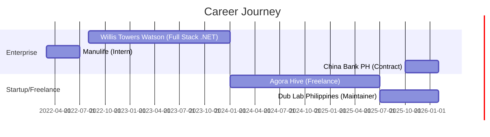

# Hey there! 👋 I'm Juaquin Victor Landayan

<div align="center">
  
  [](https://git.io/typing-svg)
  
  <a href="https://jvlandayan-portfolio.vercel.app">
    
  </a>
  <a href="mailto:jvlandayaaan@gmail.com">
    
  </a>
  <a href="tel:+639773907430">
    
  </a>
  
</div>

---

<div align="center">
  
### 💼 Professional Journey
  
**🏢 Currently Building At:**
- **China Bank PH** - *Full Stack Engineer (Contract)* | Oct 2025 - Present
- **Dub Lab Philippines** - *Full Stack Engineer (Maintainer)* | July 2025 - Present

**📊 Track Record:**
- 3+ years of professional software engineering experience
- Successfully migrated legacy systems to modern architectures
- Built and deployed production-grade microservices platforms
- Led full-stack development for multiple startups and enterprises

</div>

---

## 🛠️ Tech Arsenal

<details open>
<summary><b>🎨 Frontend Technologies</b></summary>
<br>


</details>

<details open>
<summary><b>⚙️ Backend & Architecture</b></summary>
<br>


</details>

<details open>
<summary><b>🗄️ Databases & ORMs</b></summary>
<br>


</details>

<details open>
<summary><b>☁️ Cloud & DevOps</b></summary>
<br>


</details>

<details open>
<summary><b>🤖 AI & Modern Tools</b></summary>
<br>


</details>

---

## 🚀 Featured Projects

<table>
<tr>
<td width="50%">

### 🏀 [Dub Lab Sports CMS](https://dublab.com.ph/)
A comprehensive sports content management system for Philippine basketball leagues.

**Highlights:**
- 📝 Advanced writing tools with real-time collaboration
- 🏆 Complete sports entity management system
- 🔐 Role-based authentication & authorization
- 💬 WebSocket-powered real-time messaging
- 🎨 Custom tagging system

**Stack:** Next.js, Prisma, MongoDB, Socket.io, Docker

</td>
<td width="50%">

### 🎓 InternConnect
**🏆 Best Capstone Award Winner**

Platform streamlining the internship process for University students.

**Highlights:**
- 👥 Multi-role user management
- 📊 Automated workflow processing
- 📧 Integrated notification system
- 📱 Responsive modern UI

**Stack:** .NET 5, Angular, EF Core, MSSQL

</td>
</tr>

<tr>
<td width="50%">

### ⚙️ Sports CMS API - Microservices
Redesigned version of Dub Lab CMS with enterprise architecture.

**Highlights:**
- 🏗️ Domain-Driven Design (DDD)
- 📦 Multi-layer clean architecture
- ☁️ Azure Kubernetes Service deployment
- 🔄 CI/CD with Azure Pipelines

**Stack:** .NET 9, EF Core, Azure (K8s, DevOps), Docker

</td>
<td width="50%">

### 🪙 Crypto Research Bot (RAG)
AI-powered research assistant for cryptocurrency projects.

**Highlights:**
- 🤖 RAG pipeline implementation
- 🔗 On-chain integration (Polygon)
- 🔄 Automated data orchestration
- 💾 Vector database embeddings

**Stack:** Next.js, Qdrant, Solidity, OpenAI, MongoDB

</td>
</tr>
</table>

---

## 💼 Professional Experience Timeline



---

## 🎯 Core Competencies

<div align="center">

| 🏗️ Architecture | 💻 Development | ☁️ DevOps & Cloud | 🤝 Collaboration |
|:---:|:---:|:---:|:---:|
| Microservices Design | Full-Stack Development | Azure Cloud Services | Agile/Scrum |
| Domain-Driven Design | RESTful & gRPC APIs | Docker & Kubernetes | Code Reviews |
| Clean Architecture | Database Design | CI/CD Pipelines | Technical Documentation |
| ETL Pipelines | Real-time Systems | Infrastructure as Code | Cross-team Coordination |

</div>

---

## 📈 What I'm Up To

```typescript
const currentFocus = {
  learning: [
    "Advanced Angular patterns",
    "Master ASP.NET Core Identity",
    "Advanced SQL query optimization"
  ],
  building: [
    "Microservices architectures at China Bank",
    "Sports CMS platform at Dub Lab",
    "Personal portfolio projects"
  ],
  improving: [
    "System design skills",
    "Cloud-native architectures",
    "Performance optimization"
  ]
};
```

---

## 🎓 Education & Certifications

**🏫 University of Santo Tomas**  
Bachelor of Information and Technology | 2018 - 2022

### 📜 Recent Certifications (2025)
- ✅ Complete C# Masterclass
- ✅ Entity Framework: A Full Tour
- ✅ Docker Mastery with Kubernetes
- ✅ Software Architecture & Design of Modern Large Scale Systems
- 🔄 Angular Deep Dive (In Progress)
- 📋 Master ASP.NET Core Identity (Queued)
- 📋 Advanced SQL Querying Techniques (Queued)

---

## 🌟 Highlights & Achievements

- 🏆 **Best Capstone Award** - InternConnect Project (Web & Mobile Development Track)
- 🚀 **Led Migration Projects** - HTTP to gRPC, React to Next.js with SSR
- 🏗️ **Architecture Contributions** - Co-architected microservices platforms with Azure Service Bus
- ⚡ **Performance Optimization** - Improved inter-service communication reliability
- 📚 **Knowledge Sharing** - Developed standardized service boilerplates for team efficiency

---

## 📊 GitHub Stats

<div align="center">
  
  
  

</div>

<div align="center">
  
  

</div>

---

## 🌐 Connect With Me

<div align="center">

<a href="https://app.daily.dev/jvlndyn"></a>

<br><br>

[](https://jvlandayan-portfolio.vercel.app)
[](mailto:jvlandayaaan@gmail.com)
[](https://linkedin.com/in/YOUR_LINKEDIN)

</div>

---

<div align="center">
  
### 💭 Philosophy

> "Building scalable solutions, one microservice at a time. Always learning, always growing."

**⚡ Fun Fact:** I've worked with both crypto smart contracts and enterprise banking systems!


---

**🚀 Open to exciting opportunities and collaborations!**

</div>
